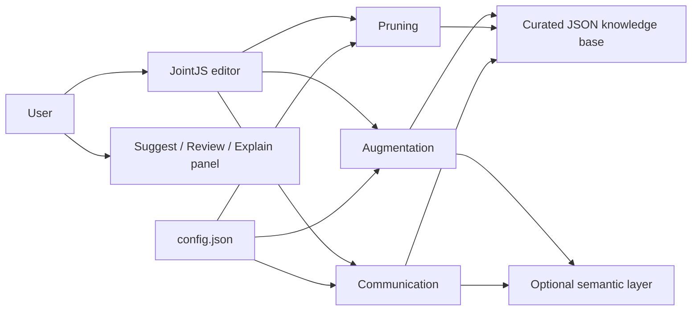

# Attack Tree Assistant — MSc Dissertation

[](https://github.com/Writban/Attack-Tree-Assistant-MSc-dissertation/actions/workflows/static-checks.yml)

An interactive browser-based attack-tree assistant developed for my MSc Computing Science dissertation at the University of Glasgow. The project investigates whether lightweight automation can help novice users build more complete attack trees, flag questionable branches for review, and understand security threats through plain-language explanations.

**Live application:** https://writban.github.io/Attack-Tree-Assistant-MSc-dissertation/

## Research questions

The dissertation investigated three questions:

1. How can automated augmentation suggest relevant risks without bloating attack trees?
2. How can pruning highlight low-value risks and simplify attack trees without removing critical paths?
3. How can attack trees be communicated in plain language to improve comprehension for non-experts?

The resulting prototype combines a JointJS attack-tree editor with three assistance modules: **Suggest**, **Review**, and **Explain**.

## What the application does

- Create and edit attack trees in an interactive graph.
- Suggest potentially missing attack steps from a curated security knowledge base.
- Use canonical names, aliases, fuzzy matching, scenario context, and an optional semantic fallback for matching.
- Flag structural or low-confidence nodes for review without automatically deleting them.
- Provide plain-language explanations and severity information for selected nodes.
- Load scenario-specific study data and save before/after tree snapshots.
- Keep thresholds and feature toggles in external configuration so behaviour can be tuned without editing the core logic.

## Architecture



The final system was deliberately client-side and lightweight. The semantic fallback uses TensorFlow.js Universal Sentence Encoder when rule-based matching is insufficient, while the primary matching path remains transparent and deterministic.

## Key implementation files

- `js/app.js` — main editor and attack-tree interaction logic.
- `js/kb-core.js` — suggestion, matching, and pruning logic.
- `js/kb-semantic.js` — optional semantic similarity layer.
- `js/kb-eval.js` — evaluation support.
- `js/kb-ui.js` — assistance-panel interface behaviour.
- `js/study.js` — study workflow and snapshot/logging support.
- `data/attack_patterns.json` — curated attack-pattern knowledge base.
- `data/aliases.json` and `data/aliases_extra.json` — natural-language alias mappings.
- `data/config.json` — thresholds, weights, and feature toggles.
- `data/scenarios/` — scenario-specific study data.
- `woz/` — development artefacts for a planned Wizard-of-Oz fallback. The dissertation records that this fallback was **not deployed in the final implementation/study**.

## Evaluation

The prototype was evaluated with **20 novice participants** using a within-subject design. Each participant first created an attack tree without assistance, then refined the same tree with the assistant enabled. Four security scenarios were available, covering authentication, private-document access, e-commerce checkout, and IoT compromise.

### RQ1 — Suggestions

The suggestion module produced the clearest quantitative improvement:

- Median tree size increased from **10 nodes to 12 nodes** after assistance.
- The paired increase was statistically significant: **Wilcoxon W = 9.0, p = 0.016**, with a reported large effect size of **r = 0.68**.
- **36 of 130 displayed suggestions** were accepted, an acceptance rate of **27.7%**.
- **80% of participants** accepted at least one of the top seven suggestions.
- The reported mean reciprocal rank of the first accepted suggestion was **0.71**, indicating that accepted recommendations were usually near the top of the ranking.

### RQ2 — Review / pruning

This was the weakest module, and the result is important rather than something to hide:

- The assistant flagged **18 nodes** for possible removal.
- Only **2 of 18** were removed, giving a pruning precision of **11%**.
- Participants retained 16 flagged nodes and also removed many nodes that had not been flagged.

The study therefore concluded that the pruning heuristics were not reliable enough to act as prescriptive deletion logic. The interaction design was more successful than the detection logic: users valued being prompted to reconsider structural issues and retained final control through **Keep** and **Remove** decisions.

### RQ3 — Explanations

The explanation feature was strongly supported by participant feedback:

- “Explain improved my understanding” had a median response of **4/5**.
- “Explanations were clear and jargon-free” had a median of **5/5**.
- The five-item explanation scale was significantly above the neutral midpoint (**p < 0.001**).
- The dissertation reports that in **57%** of explanation cases, the explained item was subsequently added to the tree.

Overall, the study found strong evidence for augmentation and explanation as useful forms of novice support, while showing that pruning requires substantially better context-sensitive heuristics.

## Design choices

Several deliberately simpler approaches were chosen over more ambitious alternatives:

- **Curated knowledge base over full CAPEC/ATT&CK ingestion:** reduced noise and made the system easier to reason about during a small user study.
- **Rule-based and fuzzy matching before semantic matching:** preserved transparency and allowed the system to work without depending entirely on an opaque similarity model.
- **Review rather than automatic deletion:** preserved user control because threat relevance is highly contextual.
- **Curated/plain-language explanation support over generative rewriting:** early LLM experiments were judged too inconsistent for the intended study setting.
- **Configuration-driven thresholds:** matching and pruning behaviour can be tuned without editing implementation code.

## Running locally

The project is a browser application. Run a local HTTP server from the repository root:

```bash
python -m http.server 8000
```

Then open:

```text
http://localhost:8000
```

## Limitations

This is an exploratory MSc research prototype, not a production threat-modelling platform.

- The study sample was small (**N = 20**) and consisted of novices rather than professional analysts.
- Participants self-selected scenarios, producing an uneven distribution across cases.
- Node count was used as a proxy for coverage, which does not guarantee that every added node was realistic or high-value.
- Detailed JSONL interaction logs were not consistently preserved, so the final analysis relied heavily on before/after tree snapshots and questionnaires.
- One participant artefact required partial reconstruction and was excluded from inferential testing where appropriate.
- The knowledge base was deliberately limited in scope.
- The pruning heuristics generated many false positives and missed removals.
- The deployed application is predominantly client-side and does not provide the authentication, access-control, collaboration, or audit features expected of a production security platform.

## Skills demonstrated

- Cybersecurity threat modelling and attack trees
- JavaScript and browser application development
- JointJS interactive graph interfaces
- Knowledge-base and rule-engine design
- Fuzzy matching and semantic similarity
- Human-centred security tooling
- Configurable decision-support systems
- User-study design and ethical evaluation
- Non-parametric statistical analysis in Python
- Translating technical security concepts for non-expert users
